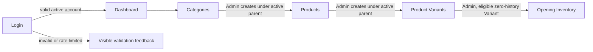
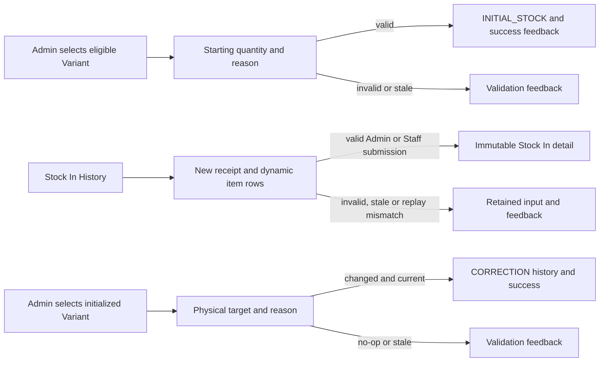
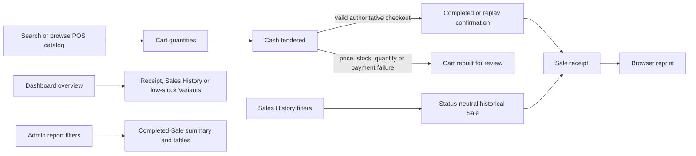

# 3A TrackPro — UI/UX Planning Baseline

## 1. Document status and purpose

This is the Tracker #5 **RETROSPECTIVE / PROJECT-DERIVED UI/UX PLANNING
BASELINE**. Much of the TrackPro interface was implemented and verified before
this formal planning artifact existed. The document therefore explains the
current interface, reconciles its role and workflow behavior with current
source, and identifies conventions and future consistency opportunities. It is
not evidence that every interface choice was planned before implementation, and
it is not a redesign specification.

Tracker #5 remains **IN PROGRESS** at this documentation checkpoint. The formal
completed tracker count remains **12 / 23**. Tracker #5 can be closed only after
this artifact is complete, source-accurate, reviewed, committed and pushed, and
a separate approved `PROJECT_STATUS.md` closeout records completion.

This baseline formalizes:

- the 22 current route-backed user-facing pages and shared interface surfaces;
- Admin and Staff role-based usage profiles;
- information architecture, navigation, responsive behavior and principal flows;
- implemented visual, form, table, feedback, accessibility and print patterns;
- source-derived usability risks and cosmetic consistency observations; and
- optional future improvements, clearly separated from current behavior.

Sources are the current application checkpoint, production routes, Blade views,
layout/navigation components, minimal JavaScript behavior, controllers and
requests where needed for visible behavior, the project requirements, and
recorded historical verification in `PROJECT_STATUS.md`. The latest completed
application checkpoint remains
`31b5b95f8d4de3136c15924bc541b52a6d2fa846` —
`Add dashboard and sales reports`.

## 2. Evidence limits

No repository evidence establishes pre-development wireframes, client-selected
colors or layouts, client UI approval/sign-off, usability interviews, observed
user testing, quantified usability findings, formal demographic personas, or a
specific client device, display, phone or printer model. This document makes no
such claims. It also makes no WCAG certification or conformance claim.

Admin and Staff below are application-role usage profiles, not undocumented
business job titles. Implemented desktop, mobile-width and browser-print support
describes software capability; it does not prove the client's actual equipment
or usage pattern. Future screenshots, a user guide and post-implementation
refinement mockups belong to separately approved work, not this baseline.

## 3. UI technology and visual foundation

The current interface uses Laravel 13, server-rendered Blade, Tailwind CSS 4,
Vite and minimal vanilla JavaScript. It has no React, Vue, SPA or third-party UI
component-library dependency. Assets use the system font stack.

The application has a utility-based set of implemented conventions rather than
a separately authored historical design system:

| Classification | Current evidence |
| --- | --- |
| Consistent implemented convention | Slate page/text foundation; white rounded bordered cards; small shadows; amber operational accent; grid-based forms and filters; divided tables; horizontal overflow for wide tables; responsive authenticated shell. |
| Isolated/local choice | Orange Login submit action and branded gradient panel; Dashboard trend bars; introductory eyebrow labels on Dashboard, POS, Sales History and Reports; receipt-specific print utilities. |
| Candidate for future standardization | Primary-action colors; status badge shape; required-field indication; inline error association; focus/hover treatment; filter reset actions; page spacing and button details. |

Color roles are broadly navy/slate for structure and primary actions, amber for
operational emphasis, emerald for success/completed states, red for validation
or archive/error states, and amber for warnings or review states. Visible text
normally accompanies state colors.

## 4. Role-based usage profiles

| Experience area | Admin | Staff |
| --- | --- | --- |
| Dashboard | Operational cards, recent completed Sales, low-stock items and seven-day completed-sales trend | Same operational content without the Admin trend |
| Reports | May view Sales Summary | Navigation item hidden; direct access forbidden |
| Categories and Products | Browse, create, edit, archive/reactivate and create children | Browse active hierarchy only |
| Product Variants | Browse with cost/status; create, edit and archive/reactivate | Browse active hierarchy without cost, status or mutation actions |
| Opening Inventory | May browse eligibility and record the one-time count | Hidden and forbidden |
| Stock In | May enter receipts and view historical receipt/item costs | May enter the current receipt's purchase cost; historical costs are hidden afterward |
| Stock Correction | May browse eligible Variants, record corrections and view history | Hidden and forbidden |
| POS | May perform cash checkout | Same operational checkout access |
| Sales History/receipt | May browse all historical Sales and reprint receipts | Same access regardless of recording user |

All protected use requires an active authenticated account. Admin has 10
navigation destinations; Staff has seven. Backend authorization is authoritative
even when restricted destinations or controls are absent from the UI.

## 5. Screen inventory

Mutation-only POST/PATCH endpoints are not counted as screens. The receipt print
presentation is a state of the Sale detail page, not another route-backed page.

| # | Screen | Route and path | Access | Purpose and primary action | Key states and responsive notes |
| ---: | --- | --- | --- | --- | --- |
| 1 | Login | `login` — `/login` | Guest | Authenticate with username and password; **Sign in** | Username retained after failure; inline/global credential or rate-limit errors; branded panels stack below `lg`. |
| 2 | Dashboard | `home` — `/` | Admin, Staff | Review current operational summaries and follow links | Four responsive cards, recent completed Sales and low stock; Admin-only trend; empty tables; wide tables scroll. |
| 3 | Categories | `categories.index` — `/categories` | Admin, Staff | Search/browse Categories; Admin can **Create category** | Admin status/lifecycle actions; Staff active-only view; 20-row pagination; empty result. |
| 4 | Create Category | `categories.create` — `/categories/create` | Admin | Enter a unique name; **Save category** | Old value, inline/global validation, Cancel. |
| 5 | Edit Category | `categories.edit` — `/categories/{category}/edit` | Admin | Rename an active Category; **Save category** | Archived direct entry conflicts; old value, validation, Cancel. |
| 6 | Products | `products.index` — `/products` | Admin, Staff | Search/filter Products; Admin creates children from Category rows | Category/status controls by role; mutation/lifecycle actions; 20-row pagination; empty result. |
| 7 | Create Product | `products.create` — `/categories/{category}/products/create` | Admin | Create within displayed active parent; **Save product** | Parent context, duplicate/active-parent validation, Cancel. |
| 8 | Edit Product | `products.edit` — `/products/{product}/edit` | Admin | Edit name and eligible active Category; **Save product** | History can lock parent transfer; stale/archived validation; Cancel. |
| 9 | Product Variants | `product-variants.index` — `/product-variants` | Admin, Staff | Search/filter sellable identities and stock | Category/Product/unit/low-stock filters; Admin cost/status/actions; 20-row pagination; wide table. |
| 10 | Create Variant | `product-variants.create` — `/products/{product}/variants/create` | Admin | Define identity, unit/mode, prices and threshold; **Save variant** | Active parent context; no current-stock field; two-column form from `sm`. |
| 11 | Edit Variant | `product-variants.edit` — `/product-variants/{productVariant}/edit` | Admin | Maintain eligible Variant fields; **Save variant** | Identity/unit/mode and cost may become locked with visible explanation; old input and validation. |
| 12 | Opening Inventory | `opening-inventory.index` — `/opening-inventory` | Admin | Find an eligible Variant; **Record opening inventory** | Search/hierarchy/initialization filters; initialized, unavailable and completed states; 20-row pagination; wide table. |
| 13 | Record Opening Inventory | `opening-inventory.create` — `/product-variants/{productVariant}/opening-inventory` | Admin | Enter starting physical quantity and reason; **Record opening inventory** | Read-only Variant context; zero allowed; whole/fractional help; stale/ineligible validation. |
| 14 | Stock In History | `stock-in.index` — `/stock-in` | Admin, Staff | Browse immutable receipts; **Record Stock In** | Newest first; Admin total cost, Staff no cost; 20-row pagination; empty history. |
| 15 | Record Stock In | `stock-in.create` — `/stock-in/create` | Admin, Staff | Enter receipt metadata and 1–100 item rows; **Record Stock In** | Dynamic add/remove rows; old-input reconstruction; eligible-Variant empty state; responsive row grid. |
| 16 | Stock In Detail | `stock-in.show` — `/stock-in/{restock}` | Admin, Staff | Review immutable receipt and movement quantities; **Back to history** | Admin total/unit/line costs; Staff costs omitted; metadata grid and horizontally scrollable item table. |
| 17 | Stock Correction | `stock-corrections.index` — `/stock-corrections` | Admin | Find eligible inventory and view history; **Correct stock** | Search/hierarchy filters; separate 15-row pagination for eligible Variants and correction history; wide tables. |
| 18 | Record Stock Correction | `stock-corrections.create` — `/product-variants/{productVariant}/stock-correction` | Admin | Enter physical target and reason; **Record Stock Correction** | Read-only current context; whole/fractional help; hidden stale version; no-op/stale validation. |
| 19 | Point of Sale | `pos.index` — `/pos` | Admin, Staff | Search catalog, build cart, tender cash; **Checkout** | Disabled out-of-stock actions; dynamic cart; notices/errors; stacked below `xl`, split/sticky cart at `xl`. |
| 20 | Sales History | `sales.index` — `/sales` | Admin, Staff | Filter all historical Sales; **View receipt** | Receipt/cashier/date filters; invalid input fails closed; status badges; 20-row pagination; wide table. |
| 21 | Sale Detail / Receipt | `sales.show` — `/sales/{sale}` | Admin, Staff | Read immutable evidence; **Print receipt** | Historical item/payment snapshots; no edit/delete/void; responsive metadata and print-specific state. |
| 22 | Sales Summary Reports | `reports.index` — `/reports` | Admin | Filter completed-Sale analytics; **Apply filters** | Seven-day default; invalid filters fail closed; summary cards, daily and unit tables; Reset; no export/print feature. |

Shared surfaces, not independent pages:

- fixed desktop sidebar;
- sticky mobile top bar, backdrop and off-canvas drawer;
- account/role block and CSRF-protected POST logout;
- global success and validation-summary alerts;
- reusable brand component;
- dynamic Stock In item rows;
- dynamic POS cart; and
- receipt print state.

No application modal is currently implemented. There are no custom TrackPro
403, 404 or 409 views; applicable failures use framework presentation.

## 6. Information and navigation architecture

The authenticated navigation is grouped as follows:

| Group | Destinations |
| --- | --- |
| Main | Dashboard; Admin-only Reports |
| Sales | POS; Sales History |
| Catalog | Categories; Products; Variants |
| Inventory | Stock In; Admin-only Opening Inventory; Admin-only Stock Correction |
| Account | Authenticated name, application role and Sign out |

At `lg` (64rem / 1024px) and above, a fixed `w-60` sidebar contains branding,
an independently scrollable grouped menu and the account area. Main content is
offset with `lg:pl-60`. The active destination has `aria-current="page"`, an
amber left border and an amber-tinted background. Destinations are filtered by
role before rendering.

Below `lg`, a sticky top bar and hamburger replace the sidebar. The drawer is
`w-72` with `max-w-[85vw]`, and a translucent backdrop covers the remaining
viewport. It closes from the explicit X control, backdrop, Escape key or a
navigation selection. Opening locks body scroll, makes application content and
the mobile bar inert, updates `aria-expanded`/`aria-hidden`, and moves focus to
the close control. Closing restores background interaction and returns focus to
the hamburger where appropriate. Crossing to desktop resets mobile state.

The drawer does not currently establish explicit `role="dialog"` or
`aria-modal` semantics, so this baseline does not describe it as a complete
modal-dialog implementation.

## 7. Principal implemented flows

### 7.1 Entry and catalog foundation

Catalog decisions and lifecycle errors are enforced on the backend. Create and
edit success returns to the relevant list with an emerald message. Duplicate,
inactive-parent, history-lock and stale-hierarchy failures return validation
feedback. Staff can traverse the active hierarchy but cannot perform mutations.

### 7.2 Inventory operations

Opening Inventory accepts zero and is exactly once. Stock In accepts one to 100
distinct active initialized Variants and supports durable equivalent replay;
completion redirects to the immutable receipt with `Stock In recorded.` or
`Stock In was already recorded.` Correction asks for a physical target rather
than a signed delta, requires a reason, and reports no-op or stale-form failures.

### 7.3 Sales, follow-up and reporting

Sales History is status-neutral: active Admin and Staff can browse all
historical Sales regardless of recording user. Completed-only filtering applies
to Dashboard and Reports analytics, not to Sales History.

### 7.4 Flow checkpoints

| Flow | Entry and actions | Decision/error points | Completion/return and role |
| --- | --- | --- | --- |
| Login → Dashboard | Guest submits assigned username/password | Required fields, generic credential failure, disabled status, rate limiting | Intended protected route or Dashboard; active Admin/Staff |
| Catalog | Categories → Product → ProductVariant | Duplicate identity, active parent, history locks and hierarchy changes | List-page success; mutations Admin-only |
| Opening Inventory | Index → eligible Variant → quantity/reason | Active hierarchy, zero starting balance, no prior activity, quantity mode | Index success and Initialized/Completed state; Admin-only |
| Stock In | History → new receipt → item rows → submit | Eligibility, duplicates, positive quantity, mode, cost, stale hierarchy, token semantics | Immutable detail and recorded/replayed message; Admin/Staff |
| Stock Correction | Eligible Variant → physical target/reason | Admin, initialization, active hierarchy, no-op, stale movement, mode | Index success and appended history; Admin-only |
| POS | Search/browse → cart → quantities → tender → checkout | Availability, mode, price refresh, insufficient stock, underpayment, token semantics | POS confirmation and receipt link; Admin/Staff |
| Sales History | Filters → Sale → receipt → reprint | Canonical receipt, cashier and Manila-date validation | Back to history; read-only Admin/Staff |
| Dashboard | Login/navigation → cards/lists/trend | Admin controls trend only | Links to operational follow-up; Admin/Staff |
| Reports | Admin filters → summaries/tables → Reset | Required date pair, valid range up to 366 days, cashier | Same-page results or fail-closed alert; Admin-only |
| Archive/reactivate | Admin list-row lifecycle action | Active child, stock, parent and current-state rules | Same list with success or validation feedback; Admin-only |

## 8. POS UX baseline

The POS presents all active, initialized Variants as a searchable catalog.
Search matches Product name, Variant identity and unit. Each card displays
identity, unit/quantity mode, current stock and selling price. An out-of-stock
Variant has a natively disabled add action.

Adding a Variant creates a cart row; adding the same Variant increments its
quantity by one. The user may manually enter quantity or remove a row. The
client calculates estimated line totals, overall total and estimated change
with scaled integer arithmetic. These are review aids only: the server remains
authoritative for eligibility, quantity mode, stock, selling price, line and
Sale totals, tender sufficiency and change.

After validation failure, old submitted items are rebuilt against the current
available catalog. A changed selling price is refreshed with a visible request
to review the cart. Unavailable Variants are removed with individual notices.
Underpayment is rejected with `The tendered cash is less than the sale total.`
and causes no successful Sale. A hidden checkout token provides durable
idempotency: equivalent replay reports `Sale was already recorded.`, while
semantic token reuse produces an error, a fresh token and a review notice.
Successful checkout reports receipt number, total, cash, change and item count,
then offers **View receipt**.

Current constraints, not implemented enhancements:

- Category is not displayed or searched in POS item context.
- Cart quantity has no adjacent client-side quantity-mode or stock-limit help.
- Invalid or underpaid tender can still show estimated `₱0.00` change before submit.
- Below `xl`, the cart follows the entire catalog in document order.
- A zero-result search has no explicit no-match message.
- Barcode entry, quick-cash buttons, keyboard-shortcut workflows and a customer
  display are absent. Their absence is not classified as a defect in current scope.

## 9. Catalog, inventory and stock UX baseline

Category → Product → ProductVariant is visible throughout catalog setup.
Creation is parent-contextual: Products start from an active Category row and
Variants start from an active Product row. Staff receives active-hierarchy
browsing without Admin cost/status or mutation controls.

Variant forms define identity, supported unit, whole/fractional mode, optional
reference cost, selling price and low-stock threshold. They never accept current
stock. Identity/unit/mode become visibly read-only or disabled after inventory
or transaction activity, and cost becomes read-only after Stock In owns it.
Low-stock presentation retains numeric stock and threshold evidence rather than
depending only on color.

Opening Inventory is a separate Admin-only, one-time physical-count workflow.
The index exposes initialization and eligibility state; the form provides
read-only hierarchy/Variant context, explains zero validity and quantity mode,
and requires a reason. The resulting movement is backend evidence; there is no
dedicated opening-movement detail screen.

Stock In uses an immutable receipt model. Admin and Staff can create a receipt
with optional reference/notes and dynamic item rows. Selecting a Variant reveals
Product, identity, unit, mode and current stock. Quantity and current receipt
purchase cost are entered per row. Admin can later view historical total,
unit and line costs; Staff may enter the new receipt cost but those historical
cost fields are withheld from Staff history/detail.

Stock Correction is Admin-only. Its physical-target model avoids requiring the
Admin to calculate a signed adjustment. It shows current context, requires a
reason, rejects stale/no-op submissions, and appends immutable history showing
before, signed change, after, actor, time and reason.

Current clarity and consistency concerns:

- catalog filters do not share the Clear/Reset actions used by Sales/Reports;
- status representation varies between plain text, rectangular badges and pills;
- Opening Inventory uses a generic unavailable reason;
- wide catalog/inventory tables preserve columns through horizontal scrolling;
- Stock In item context omits Category;
- repeated Stock In errors rely heavily on the global validation summary;
- the Staff empty-state instruction to complete Opening Inventory can imply an
  action Staff is not authorized to perform; and
- Staff is not explicitly warned during entry that later historical cost
  visibility is restricted.

## 10. Sales History, receipt, Dashboard and Reports

Sales History is read-only and status-neutral for both roles. Receipt, cashier
and inclusive Manila-calendar date filters narrow results; malformed filters
fail closed rather than falling back to all Sales. Results are newest first and
paginated by 20. The current eyebrow text says **Completed transactions** even
though the page intentionally preserves and can display every historical Sale
status. That text is a future content-correction candidate, not the semantic
truth of the page.

The Sale detail/receipt uses immutable Sale and SaleItem evidence: receipt
number, status, recording user (labelled Cashier), date/time, Product and Variant
snapshots, historical unit, quantity, unit price, line total, Sale total, cash
and change. It has no edit, delete or void control and exposes no purchase cost,
checkout token or StockMovement internals.

The shared Dashboard presents Today's Sales, Transactions Today, Low Stock, Out
of Stock, up to five Recent Completed Sales and up to five Low Stock Items.
Admin additionally receives a seven-day Completed Sales Trend. Exact text sits
beside visual bars. Follow-up links lead to receipts, Sales History and filtered
Variants.

Sales Summary Reports is Admin-only. It defaults to today plus the prior six
Manila calendar days and supports strict date-pair and optional cashier filters.
It reports completed-Sales total/count, zero-filled daily rows and quantity sold
grouped by immutable unit snapshots. It includes no purchase cost, formal COGS,
profit, export or dedicated report-print feature. When filters are invalid, a
report-not-run alert may coexist with zero-valued summary cards; this is recorded
as a minor interpretation risk.

## 11. Form, table and feedback conventions

### Forms

Implemented forms generally provide visible labels, CSRF protection for
mutations, native required/length/number or disabled/read-only states, old-input
retention, optional-field wording, and Save/Submit with Cancel or Back actions.
Operational decimal inputs use exact server validation even where client input
modes or constraints assist entry. Server authorization and validation remain
authoritative.

Current inconsistencies are the absence of a shared visible required marker,
non-universal inline errors, many errors not programmatically linked to their
field, and focus styling that is explicit in navigation/Login but not formally
standardized across every control.

### Tables and lists

The common pattern is a rounded white bordered container, slate header, divided
rows, left-aligned identity text, right-aligned numeric/action columns, a
contextual empty row and horizontal overflow for wide content. Pagination exists
for Categories, Products, Variants, Opening Inventory, Stock In History, Sales
History, and both Stock Correction lists. Reports are not paginated.

Search exists on Categories, Products, Variants, Opening Inventory, Stock
Correction and POS. Filter capabilities differ by module: catalog hierarchy,
status, unit and low-stock filters; Sales receipt/cashier/date filters; and
Reports date/cashier filters. Stock In History has no filter. There is no
user-selectable sorting; ordering is backend-defined.

### Feedback and exceptional states

- Emerald global alerts communicate successful mutations.
- Red global summaries and selective inline messages communicate validation.
- Amber notices communicate review, changed-price, unavailable-item and other
  non-success attention states.
- Business-rule failures provide specific messages, including exact available
  stock and underpayment feedback.
- Equivalent Stock In/POS retries receive explicit already-recorded feedback.
- Empty tables, unavailable catalogs and an empty cart have contextual text.
- Guests are redirected to Login; a disabled continued session is invalidated.
- Unauthorized Admin-only access returns 403, missing records return 404, and
  ineligible direct entries can return 409 through framework presentation.

## 12. Responsive strategy

The app shell switches at `lg`: fixed sidebar and content offset at/above 1024px,
mobile top bar/drawer below it. Implemented content patterns include:

- Dashboard cards: one column, two at `sm`, four at `xl`;
- Dashboard lower panels: stacked, then two columns at `xl`;
- POS: stacked below `xl`, split catalog/sticky 25rem cart at `xl`;
- POS catalog: one column, two at `sm`, three at `2xl`;
- Stock In item rows: stacked, then a 12-column row at `lg`;
- metadata/form grids: commonly one column, then two at `sm` or `md`;
- Sales filters: five-column layout only at `xl`;
- Reports filters: four columns at `lg`;
- other catalog/inventory filters: `sm` or `md` grids;
- receipt metadata: one column, then two at `sm`; and
- wrapping heading/action rows where implemented.

Wide tables primarily preserve their desktop columns and use horizontal
scrolling at narrow widths. This plan does not claim that every table becomes a
mobile card layout. Historical responsive-navigation and Dashboard/Reports
browser evidence is recorded in `PROJECT_STATUS.md`; no browser session was run
for this documentation checkpoint.

## 13. Accessibility evidence and limitations

### Implemented evidence

- document language and viewport metadata;
- semantic main, navigation, heading, section, article, table, definition-list,
  link, button and form-label elements;
- navigation labels, `aria-current`, `aria-controls`, `aria-expanded` and
  `aria-hidden`;
- native `inert`, Escape closure, focus entry and focus return for mobile navigation;
- global `role="alert"` and `role="status"` feedback;
- decorative image/SVG handling and accessible names around brand/icon controls;
- visible text accompanying status colors;
- native disabled/read-only states;
- `aria-describedby` quantity help on Opening Inventory and Stock Correction; and
- exact text values beside decorative Dashboard trend bars.

### Partial evidence

- tables have header cells but no comprehensive caption/`scope` convention;
- inline field errors are not consistently connected through error IDs,
  `aria-describedby` or `aria-invalid`;
- dynamic POS totals/cart changes and Stock In row changes have no live-region
  announcement;
- the drawer has strong inert/focus behavior but no explicit dialog/`aria-modal`
  semantics or coded wraparound focus trap; and
- visible focus treatment is not formally standardized across every control.

### Not established

- WCAG conformance or certification;
- a formal contrast audit;
- screen-reader testing;
- reduced-motion testing;
- comprehensive keyboard testing outside recorded navigation evidence; or
- usability studies with Admin or Staff users.

## 14. Receipt print UX

The receipt's **Print receipt** control invokes `window.print()`. Print utilities
hide the desktop sidebar, mobile bar, drawer/backdrop, global alerts, Back link
and Print control; remove the desktop content offset; and simplify the receipt
card by removing radius, border, shadow and outer padding. Branding, receipt
metadata, item evidence, status and payment totals remain.

The same authenticated immutable receipt can be viewed and reprinted without a
new Sale, inventory change or AuditLog write. Recorded historical Firefox Print
Preview evidence confirms that a representative receipt suppressed application
chrome and fit one sheet. This is historical verification, not a browser run for
this document.

Reports have no dedicated print route/control, report-specific print design,
PDF generation or CSV export. Global shell print hiding does not establish a
supported report-print feature.

## 15. Consistency and risk classification

### 15.1 Consistent implemented patterns

- Slate/white/amber visual foundation with rounded bordered surfaces.
- Clear page and section headings with short purpose text.
- Role-filtered navigation and backend-authoritative permissions.
- Parent-contextual catalog creation and explicit lifecycle controls.
- Reusable list/filter/table/empty-state structure.
- Exact numeric evidence for stock, payment and historical transactions.
- Emerald success, red error and amber warning/review feedback.
- Responsive grids plus safe horizontal overflow for detailed tables.
- Immutable detail surfaces for Stock In and Sales receipts.

### 15.2 Genuine usability risks

These are source-derived risks identified by implementation review, not proven
user failures or quantified usability findings:

1. Missing Category context in POS and Stock In item selection can make
   duplicate-looking Product/Variant identities harder to distinguish.
2. Archive submits immediately without a confirmation naming the affected
   record. Archive is reversible and backend-guarded, but accidental lifecycle
   changes remain possible.
3. Below `xl`, the POS cart follows the complete catalog, which can require
   substantial scrolling as the catalog grows.
4. Repeated-row Stock In/POS validation is not strongly associated with the
   affected row/control.
5. The status-neutral Sales History page has a `Completed transactions` eyebrow.
6. Opening Inventory's unavailable state does not identify the failed
   eligibility condition.
7. Dynamic POS and Stock In changes lack assistive announcements.
8. Invalid Reports can retain zero-valued summary cards beneath the explicit
   report-not-run alert.

### 15.3 Cosmetic/non-blocking observations

- Introductory eyebrow labels appear on newer operational pages but not most
  catalog/inventory pages.
- Page padding and vertical spacing vary slightly between modules.
- Status presentation alternates among plain text, rectangular badges and pills.
- Primary actions use navy, amber or the Login-specific orange according to
  local context without a documented universal hierarchy.
- Hover/focus utilities and border/radius details are not identical everywhere.
- Some older Blade templates are compressed in source formatting; this does not
  itself change rendered usability.

## 16. Future recommendations — not yet implemented

The following are optional future refinements, not current TrackPro features and
not implementation scope for this documentation checkpoint:

1. Include Category in POS cards/search and Stock In option/metadata context.
2. Add an archive confirmation that names the affected Category, Product or Variant.
3. Add a mobile POS cart shortcut or sticky cart summary.
4. Standardize field-error IDs, `aria-describedby`, `aria-invalid` and repeated-row placement.
5. Replace the Sales History eyebrow with status-neutral wording.
6. Show specific Opening Inventory ineligibility reasons.
7. Give Staff an instruction to contact an Admin when Opening Inventory is required.
8. Hide or replace report summary cards when filters prevent report execution.
9. Standardize action hierarchy, status badges, required markers, focus
   treatment and filter Reset/Clear actions.
10. Add assistive live announcements for meaningful POS and Stock In updates.

Post-implementation refinement mockups could be considered only in separately
approved future work. They must not be described as original pre-development
wireframes.

## 17. Tracker boundaries, baseline and completion standard

Tracker #5 provides UI/UX planning evidence. It does not complete or start:

- #7 Test Case Preparation;
- #15 Functional Testing;
- #17 Edge Case & Permission Testing; or
- #18 User Guide & Screenshots.

No new usability test, screenshot collection or user guide was produced. No UI
recommendation was implemented. SALE_VOID and User Management remain outside
this work.

The historical ordinary software baseline remains **191 tests / 2,023
assertions**, 27.576 seconds, using isolated SQLite `:memory:`. The historical
application route baseline remains **40**. These results were not rerun for this
documentation-only checkpoint; no test, build, browser or database gate is
required here.

Tracker #5 may be formally closed when this single planning artifact is complete,
source-accurate, reviewed, committed and pushed, followed by a separate approved
`PROJECT_STATUS.md` closeout. Open risks and future recommendations do not block
planning completion because Tracker #5 is a planning tracker, not a redesign or
bug-fix tracker. Until that separate closeout, Tracker #5 remains **IN PROGRESS**
and the formal count remains **12 / 23**.
